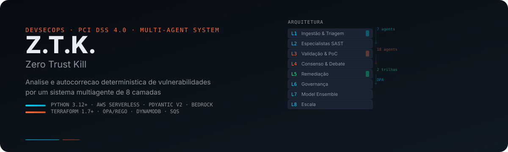
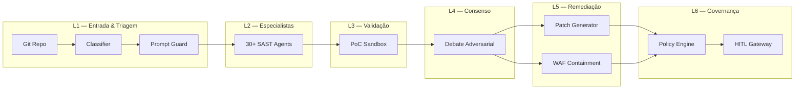

<p align="center">
  
</p>

<p align="center">
  
  
  
  
  
</p>

---

## Visão Geral

O **Z.T.K.** (Zero Trust Kill) é um sistema multiagente que automatiza o ciclo
completo de detecção, triagem, validação, priorização e remediação de
vulnerabilidades em código, infraestrutura e dependências — para ambiente de
adquirência com requisitos **PCI DSS 4.0**, **LGPD** e **BACEN**.

### Princípio Central

> **"Sempre que existir uma ferramenta determinística capaz de resolver a
> tarefa, o LLM não decide — ele apenas interpreta a saída da ferramenta."**

O sistema combina **8 camadas de processamento**, **133 agentes especializados**,
e um **pipeline SSVC determinístico** que substitui a priorização manual por CVSS.

---

## Arquitetura



### Camadas

| # | Camada | Função | LLM? |
|---|--------|--------|------|
| **L1** | Entrada & Triagem | Ingestão, classificação, prompt-injection guard | ❌ |
| **L2** | Especialistas | 30+ agentes SAST, SCA, Hardening, Secrets | Parcial |
| **L3** | Validação | Reachability, PoC sandboxed, fuzzing, score engine | ❌ |
| **L4** | Consenso/Debate | CVSS+EPSS+SSVC, piso não-negociável, debate adversarial | ✅ |
| **L5** | Remediação | Trilha A (patch) + Trilha B (contenção WAF) | ✅ |
| **L6** | Governança | Policy Engine OPA, auditoria, HITL, four-eyes | ❌ |
| **L7** | Model Ensemble | Roteamento LLM (vLLM local vs Bedrock), circuit breaker | ✅ |
| **L8** | Escala | Ativação condicional, onboarding, multi-tenancy | ❌ |

---

## Stack Tecnológica

| Categoria | Tecnologia |
|-----------|-----------|
| **Linguagem** | Python 3.12+ (type hints, mypy strict) |
| **Schemas** | Pydantic v2 |
| **Infra** | AWS Lambda, ECS Fargate, Bedrock, DynamoDB, S3, SQS |
| **IaC** | Terraform 1.7+ (10 módulos) |
| **Políticas** | OPA/Rego |
| **Logging** | structlog JSON (CloudWatch) |
| **Testes** | pytest (85%+ cobertura), bandit, truffleHog |
| **CI/CD** | GitHub Actions |

---

## Estrutura do Repositório

```
ZTK/
├── assets/readme/              ← Identidade visual (SVG hero)
├── mvp2/copilot/               ← MVP2: Copiloto LLM (M4)
│   ├── src/copilot/            ← 8 módulos Python
│   ├── tests/                  ← 49 testes
│   └── data/                   ← RAG index + prompt schema
├── src/                        ← 8 camadas (Fase 0 em andamento)
│   └── shared/                 ← Schemas + Utils (F0.1 ✅)
├── infra/terraform/            ← IaC — 10 módulos (F0.2 ✅)
├── docs/                       ← ADRs, runbooks, compliance, threat model
│   ├── architecture/           ← 5 ADRs
│   ├── runbooks/               ← Contenção, kill-switch, four-eyes
│   ├── compliance/             ← PCI DSS 4.0 + LGPD
│   ├── ssdlc/                  ← S-SDLC + Threat Model STRIDE
│   ├── infra/                  ← Documentação de infraestrutura
│   ├── api/                    ← API docs (Copilot)
│   ├── operacoes/              ← Deploy + Resposta a Incidente
│   └── visual-identity/        ← Guia de design
├── tests/                      ← Testes unitários
├── .opencode/                  ← 12 agentes especializados
├── opencode.json               ← Configuração do workspace
├── AGENTS.md                   ← Regras do agente
├── README.md                   ← Você está aqui
└── TASKS_ZTK.md                ← Backlog 12 fases, 120+ tasks
```

---

## Quick Start

```bash
# 1. Clone
git clone https://github.com/rcenerini/Z.T.K..git
cd Z.T.K.

# 2. Dependências
python -m venv .venv && source .venv/bin/activate  # Linux/macOS
# .venv\Scripts\activate                           # Windows
pip install -e ".[dev]"

# 3. Testes — todos os módulos
bash scripts/run_all_tests.sh      # Linux/macOS
# powershell scripts/run_all_tests.ps1  # Windows

# 4. Pre-commit hooks (recomendado)
cp scripts/pre-commit/pre-commit-hook.sh .git/hooks/pre-commit
chmod +x .git/hooks/pre-commit
```

### Pré-requisitos

- Python 3.12+
- Git
- (Opcional) OPA CLI — para testes de políticas
- (Opcional) AWS CLI + Terraform — para deploy da infraestrutura

---

## Roadmap

| Milestone | Semanas | Entregável | Status |
|-----------|---------|------------|--------|
| **M0** | 1-4 | Fundação (schemas, infra, CI/CD) | ✅ |
| **M1** | 5-6 | Camada 1 — Entrada & Triagem | ✅ |
| **M2** | 7-10 | Camada 6 — Governança | ✅ |
| **M3** | 11-18 | Camada 2 — Especialistas | ✅ |
| **M4** | 19-24 | Camada 3 — Validação | ✅ |
| **M5** | 25-28 | Camada 4 — Consenso/Debate | ✅ |
| **M6** | 29-34 | Camada 5 — Remediação | ✅ |
| **M7** | 35-38 | Camada 7 — Model Ensemble | ✅ |
| **M8** | 39-42 | Camada 8 — Escala | ✅ |
| **M9-M12** | 43-52 | Interface, Docs, SecTests, Governance | ✅ |

---

## Compliance

| Framework | Cobertura | Evidência |
|-----------|-----------|-----------|
| **PCI DSS 4.0** | 45% (controles projetados, IaC provisionada) | [Matriz](./docs/compliance/pci-dss-matrix.md) |
| **LGPD** | 84% (3 itens dependem de DPO externo) | [Matriz](./docs/compliance/lgpd-matrix.md) |
| **ISO 27001** | Mapeado via Threat Model STRIDE | [Threat Model](./docs/ssdlc/threat-model-ztk.md) |
| **BACEN 4658** | Alinhado (4 pilares) | [S-SDLC](./docs/ssdlc/S-SDLC.md) |

---

## Documentação

| Área | Documentos |
|------|-----------|
| **Decisões** | [ADR-001](./docs/architecture/ADR-001-ecs-vs-eks.md) · [ADR-002](./docs/architecture/ADR-002-model-routing.md) · [ADR-003](./docs/architecture/ADR-003-prompt-injection-guard.md) · [ADR-004](./docs/architecture/ADR-004-sandbox-isolation.md) · [ADR-005](./docs/architecture/ADR-005-cwe-template-library.md) |
| **Operação** | [Contenção](./docs/runbooks/containment-playbook.md) · [Kill Switch](./docs/runbooks/kill-switch-playbook.md) · [Four-Eyes](./docs/runbooks/exception-four-eyes-playbook.md) · [Deploy](./docs/operacoes/runbook-deploy.md) · [Incidente](./docs/operacoes/runbook-incidente.md) |
| **Segurança** | [Threat Model](./docs/ssdlc/threat-model-ztk.md) · [S-SDLC](./docs/ssdlc/S-SDLC.md) · [PCI Matrix](./docs/compliance/pci-dss-matrix.md) · [LGPD Matrix](./docs/compliance/lgpd-matrix.md) |
| **API** | [Copilot API](./docs/api/copilot-api.md) |
| **Infra** | [Arquitetura de Infra](./docs/infra/README.md) |
| **Design** | [Identidade Visual](./docs/visual-identity/VISUAL_IDENTITY.md) |

---

## Licença

MIT — veja [LICENSE](LICENSE).

